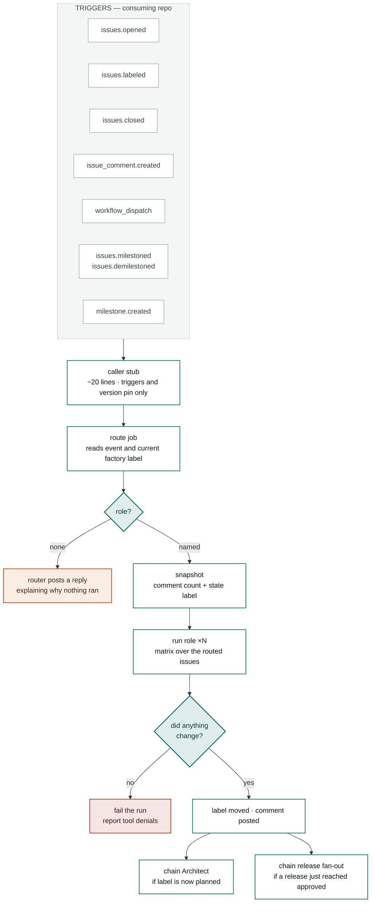
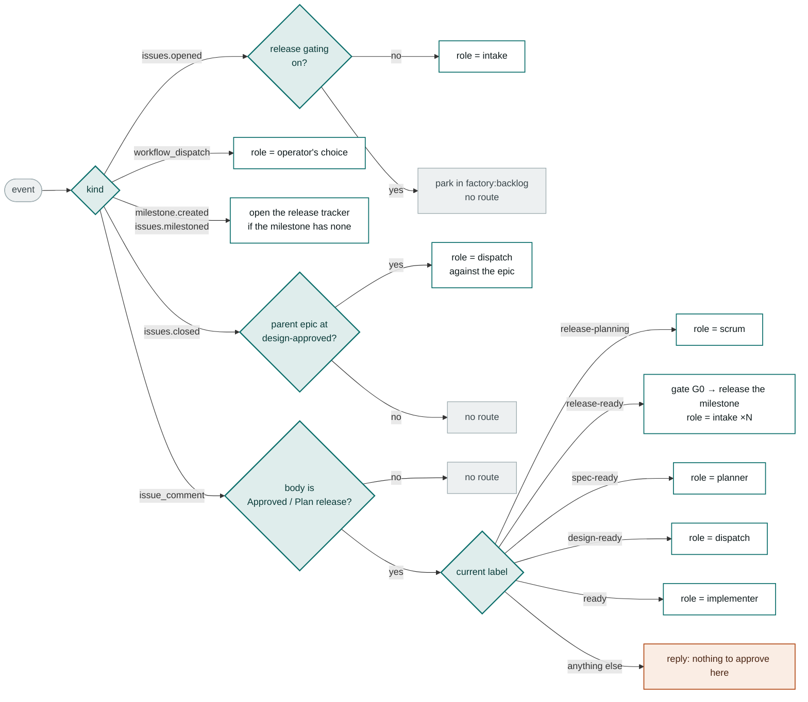

# Control Architecture

A consuming repo holds seven files and none of them are logic. Everything that
decides — the router, the eleven role prompts, the guards — lives in
`claude-software-factory` and is pulled in at run time.

## Control path



Nothing reaches a role until the router names one, and no run is allowed to
finish green without leaving a visible trace on the issue.

One check runs before everything above: the route job reads
`.github/factory-orchestrator.json` from the caller's checkout, and when it
names an external engine (FACTORY.md §2e — e.g. `langgraph`) the job exits
with `role=none` before any side effect, logging which engine holds the
claim. That is the whole Actions half of the exactly-one-engine guarantee;
the external engine holds the other half by refusing repos whose config does
not name it. The routing decision table itself is pinned by the shared
conformance fixtures (`orchestrator/conformance/`), which both engines run
in CI.

## Router decision table



Commenting **Approved** does something in exactly four states. Anywhere else
the router says so rather than finishing silently.

## The caller stub

The only file that ever needs touching to upgrade. It owns the triggers and the
version pin, and nothing else:

```yaml
on:
  issues:
    types: [opened, labeled, closed, milestoned, demilestoned]
  issue_comment:
    types: [created]
  milestone:
    types: [created, opened]
  workflow_dispatch:
    inputs:
      issue_number: { description: "Issue (or PR) number", required: true }
      role:         { description: "Factory role to run",  required: true, type: choice,
                      options: [scrum, intake, planner, architect, dispatch, implementer,
                                reviewer, qa, release, ops] }

permissions:
  contents: write
  issues: write
  pull-requests: write
  id-token: write

jobs:
  factory:
    uses: genai-jerry/claude-software-factory/.github/workflows/factory-pipeline.yml@v1
    secrets: inherit
    with:
      role: ${{ inputs.role }}
      issue_number: ${{ inputs.issue_number }}
      factory_ref: v1
```

Three things bite people here:

- **The stub must declare `permissions:` itself.** A called workflow's token is
  capped by the caller's, so a stub missing that block inherits the repo default
  and fails at startup before any job runs.
- **A called workflow cannot declare its own triggers.** Events are the one
  thing a consuming repo genuinely owns — which is why enabling a new trigger,
  like `closed` or `milestoned`, is a change to the stub and not to the pipeline
  body. A stub missing the milestone triggers silently loses release gating.
- **The factory raises events too**, and `claude-code-action` refuses a
  non-human actor unless the bot is named. The pipeline passes `allowed_bots`,
  defaulting to `claude` — its own App — so an issue the factory filed on a
  human's behalf still gets a run. Override it in the stub only if your factory
  runs under a differently-named App; `*` allows every bot and is unsafe on a
  public repo. What decides whether an event deserves a run is the router, not
  the author of the issue.

Bump both `@v1` refs together when upgrading.

## The ten roles

A role is a prompt plus the repo's profile. It reads the issue, does its job,
and leaves behind exactly one state change — which is what the next trigger
keys on.

| # | Role | What it does | Leaves |
|---|---|---|---|
| 00 | Scrum Master | Reads a whole release milestone: scope, duplicates, sequencing, oversized items. Optional — see [[Release Gating]] | `factory:release-ready` |
| 01 | Intake Analyst | Reads the request, sizes scope and prerequisites, flags anything unworkable | `factory:spec-ready` |
| 02 | Planner | Turns an approved spec into deliverables, phasing and merge order | `factory:planned` |
| 03 | Architect | Commits to a technical approach and writes down the decisions behind it | `factory:design-ready` |
| 04 | Dispatcher | Fans the epic out into task sub-issues and releases the ones with no blockers | `factory:design-approved` |
| 05 | Implementer | Writes the change on a branch, runs the repo's own test and lint commands, opens the PR | `factory:in-review` |
| 06 | Reviewer | Checks the diff against the approved design, not just against itself | `factory:in-test` |
| 07 | QA | Runs the suite and the acceptance criteria; files bugs rather than waving things through | `factory:ready-to-ship` |
| 08 | Release | Stages the bundle and runs the health checks. Cannot merge to `main` — that is gate G3 | `factory:deployed` |
| 09 | Ops | Watches production, opens incidents, drives rollback when a deploy misbehaves | `factory:incident` |

The eleven prompts are **byte-identical in every repo**. Everything a role needs to
know about your codebase — stack, test/build/lint commands, conventions, review
checklist, known-failing tests, health checks — lives in `.factory/profile.json`.
A missing or unparseable profile hard-blocks the per-repo roles rather than
letting them guess.

## Four guards

Each of these was a real stall before it was a guard.

### The invisible run

**Symptom.** An issue sits at `factory:intake` and nobody can tell whether an
agent is working on it or whether the pipeline dropped it. The honest answer
was in the Actions tab, one repository away from where the question is asked.

**Cause.** Roles run for minutes and post nothing until they finish, so a live
run and a stalled issue look identical on the issue itself.

**Guard.** Each agent job applies `factory:in-progress` to its issue before the
role starts and removes it in an `always()` step when the job ends — so it also
comes off on a failure, on a no-op-guard failure and on the 45-minute timeout.
The marker is applied with the workflow token, whose label changes emit no
events, so a cosmetic label can never trigger another run. Everywhere the
router reads `factory:*` labels as *state* it ignores this one: a marked issue
is still "not started" to a release batch, still eligible for the fast lane,
and the explanatory replies still name the real state. It is read as itself in
exactly one place — the implementation start, where `factory:ready` stays put
for the whole run and a second `Approved` would otherwise start a second
implementer on the same task and branch.

### The silent hand-off

**Symptom.** A role finishes, the label moves, and the thread goes quiet. The
issue is now at `factory:in-review` (or `in-test`, or `ready-to-ship`) and
nothing on it says whose turn it is — least of all that those three states
start nothing on their own and are *waiting for a human to start the next
role*. Reading the state machine by heart was the only way to know.

**Cause.** The pipeline said plenty when it refused something and nothing when
it succeeded. Hand-off notices existed only for labels applied by a human
(`notifyOf` on the `labeled` event), and labels applied by a run emit no
events.

**Guard.** Every role run ends with one comment on the issue naming the state
it left behind, the next actor, and the exact control that actor uses. The
wording is data — `handbook/next-step.json`, one entry per state — rendered by
both engines so they cannot drift, and said once per state entry so a re-run
does not repeat it while a genuine re-entry (review → ready → review) does.
It posts *after* the no-op guard, so it can never be the visible trace that
lets a role which did nothing pass for one that worked.

### The silent green

**Symptom.** A run finishes green and the issue has not moved at all.

**Cause.** A headless run has nobody to answer a permission prompt, so every
tool outside `--allowedTools` is refused. The role reads the repo, cannot write,
and exits 0. `claude-code-action` reports success either way.

**Guard.** Snapshot the comment count and `factory:*` label before the role runs,
re-read after. If neither moved, fail the step:

```
Role 'intake' finished but changed nothing on #16 - no factory:* label change
and no new comment. 13 tool permission denial(s) were recorded - the
--allowedTools list in this workflow is the likely cause.
```

The trace required is *label moved **or** comment posted*. A role may
legitimately decline to advance an issue — intake recommending
`factory:fast-track`, any role applying `factory:blocked` — but it always says so
on the issue first. **A run that says nothing did nothing.**

The reusable pipeline passes the allow-list itself, so this only bites a fork
that trimmed those flags, or a repo whose `.claude/settings.json` adds a
`permissions.deny` entry covering `Bash`.

### The dead comment

**Symptom.** Someone types **Approved** and nothing happens, with no explanation.

**Cause.** The comment landed on a state the router has no branch for.

**Guard.** When **Approved** routes nowhere, the router replies naming the four
states where it works and the state the issue is actually in. Same for a reply
on a `factory:blocked` issue whose stage has no automatic resume step, and for
an **Approved** on a release tracker that hasn't been planned yet.

### The stranded dependent

**Symptom.** A blocking task merges and the tasks behind it stay unlabelled
forever.

**Cause.** The Dispatcher ran once at `factory:design-approved` and nothing was
watching for task completions.

**Guard.** Adding `closed` to the stub's issue triggers lets a task closing
re-run the Dispatcher against its parent epic. Full detail in
[[Re-dispatch on Task Close]].

## See also

- [[Factory Pipeline States]] — the states the router reads
- [[Release Gating]] — the milestone events, the tracker issue and the fan-out
- [[Run Trace Issue 16]] — this architecture exercised end to end
