# Factory Pipeline States

Every issue in the factory carries exactly one `factory:*` label. That label is
the whole state — it decides which of the ten roles runs next, and nothing
advances without it moving.

The pipeline is not fifteen equal steps. It is **four phases**, each ending at a
point where a person decides whether the machine keeps going. Between those
points the factory runs unattended.

Phase 0 is optional: [[Release Gating]] describes it, and a repo without
`.github/factory-release.json` skips straight to phase 1 the moment an issue is
filed.

## The pipeline

```mermaid
flowchart TB
  OPEN(["issue opened"]) --> R0

  subgraph P0["PHASE 0 — RELEASE · optional · states live on two issues"]
    direction LR
    R0["the issue:<br/>factory:backlog"]
    R1["its release tracker:<br/>factory:release-planning"] -- "Scrum Master" --> R2["factory:release-ready"]
    R2 -- "G0 · Approved" --> R3["factory:release-approved"]
    R0 -. "added to that milestone" .-> R1
  end

  R3 -- "releases every<br/>backlog issue in it" --> A

  subgraph P1["PHASE 1 — DEFINITION"]
    direction LR
    A["factory:intake"] -- "Intake Analyst" --> B["factory:spec-ready"]
    B -- "G1 · Approved" --> C["factory:spec-approved"]
  end

  subgraph P2["PHASE 2 — DESIGN"]
    direction LR
    D["factory:planned"] -- "Architect<br/>auto-chained" --> E["factory:design-ready"]
    E -- "G2 · Approved" --> F["factory:design-approved"]
  end

  subgraph P3["PHASE 3 — DELIVERY"]
    direction LR
    G["factory:ready"] -- "Implementer" --> H["factory:in-review"]
    H -- "Reviewer" --> I["factory:in-test"]
    I -- "QA" --> J["factory:ready-to-ship"]
    J -- "Release Manager<br/>merges onto the epic branch" --> E2["factory:on-epic"]
    E2 -- "epic complete<br/>and green" --> ER["factory:epic-ready"]
    E2 -. "system tests on:<br/>Dispatcher releases<br/>its cases" .-> MT["a case:<br/>factory:manual-test"]
    MT -- "Test Passed" --> TP["factory:test-passed"]
    MT -. "Test Failed" .-> TF["factory:test-failed<br/>fix task filed"]
    TF -. "fix lands" .-> MT
    TP -. "last case" .-> ER
    ER -- "GS · Approved<br/>release to staging" --> S["factory:in-staging"]
    S -- "G3 · human merges<br/>the promotion PR" --> K["factory:deployed"]
  end

  C -- "Planner" --> D
  F -- "Dispatcher<br/>fans out" --> G
  A -. "blocker found" .-> X(["factory:blocked"])

  classDef state fill:#FFFFFF,stroke:#0B6E6B,stroke-width:1.5px,color:#0F1A1C
  classDef gate fill:#FAEDE4,stroke:#B24A17,stroke-width:2px,color:#4A2412
  classDef done fill:#DFEDEC,stroke:#0B6E6B,stroke-width:2.5px,color:#0A3B39
  classDef halt fill:#F5E6E3,stroke:#A33526,stroke-width:1.5px,color:#4E1811
  classDef entry fill:#EDF0F1,stroke:#9FADB1,stroke-width:1.5px,color:#3A464B

  class A,C,D,F,G,H,I,J,E2,R0,R1,R3,TP state
  class MT,TF gate
  class B,E,S,ER,R2 gate
  class K done
  class X halt
  class OPEN entry

  style P0 fill:#F4F6F6,stroke:#C6CFD2,color:#3A464B
  style P1 fill:#F4F6F6,stroke:#C6CFD2,color:#3A464B
  style P2 fill:#F4F6F6,stroke:#C6CFD2,color:#3A464B
  style P3 fill:#F4F6F6,stroke:#C6CFD2,color:#3A464B
```

Rust-filled states wait on a human. Everything else advances on its own the
moment the previous role finishes.

The three test states hang off `factory:on-epic` and exist only where
`.github/factory-testing.json` turns system tests on (FACTORY.md §4b). They
live on `test(<epic>)` sub-issues, never on an epic or a code task: the Test
Planner writes a plan of human-run cases at stage 2a, the Dispatcher releases
each one when the code it depends on is assembled, and a tester comments
`Test Passed` or `Test Failed`. In `gate` mode the epic reaches
`factory:epic-ready` only once every case has passed — the last pass is what
flips it.

The `factory:on-epic` hop exists only with the epic-branch policy on
(`"epics": true` in `.github/factory-branches.json`, FACTORY.md §6b). With it
off, tasks wait at `factory:ready-to-ship` until the whole epic is there; the
epic then goes to `factory:epic-ready`, and gate GS releases it — the
Release Manager merges task PRs directly onto the integration branch, the
pre-epic behaviour.

## The gates

| Gate | State it holds at | The question | How it opens |
|---|---|---|---|
| **G0** | `factory:release-ready` | Is this the right batch of work to start? | Owner comments `Approved` on the release tracker — or, in `"approval": "agent"` mode, the Scrum Master's own GO |
| **G1** | `factory:spec-ready` | Is the spec concrete enough to plan against? | Owner comments `Approved` |
| **G2** | `factory:design-ready` | Does the architecture actually solve it? | Owner comments `Approved` |
| **GS** | `factory:epic-ready` | May this assembled epic go to staging? | A `staging` approver comments `Approved` (falls back to the `release` list). With system tests in `gate` mode the epic only arrives here once every case has passed |
| **G3** | `factory:in-staging` | May this land on `main`? | A human presses Merge on the promotion PR |

G0 only exists with release gating on, and is the one gate that can be handed to
an agent — the set of issues in a milestone is input a model can read
completely, unlike a diff's consequences.

GS is where the **expedite** switch stops. An epic labelled `factory:expedite`
(FACTORY.md §4a) opens G1 and G2 itself and runs every task's
implement → review → test → assemble without a start button — and then arrives
here and waits, exactly like every other epic. GS and G3 are the two gates no
marker waives, because they are the two moments code leaves the factory's own
branches.

G3 is not a comment, and by the time it is asked the answer is already
evidenced: every PR has been merged onto the org's **integration branch** —
`staging`, `develop`, `qa`, whatever the estate calls it — and the staging
deploy and health checks have run there. That is the `factory:in-staging` step,
and it is the Release Manager's, not a human's. What a human merges at G3 is one
promotion PR per repo, integration → `main`. See FACTORY.md §6a.
The factory has no permission to write to `main` at all —
it is enforced by the protected-branch hook, the `permissions.deny` block in
`.claude/settings.json`, and `factory-branch-guard.yml`, which opens a
`factory:incident` issue if a commit ever lands on `main` without a PR.

Who may approve at G0, G1, G2 and GS is set per-gate in
`.github/factory-approvers.json` — GS reads the `staging` key and falls back to
`release`. The `expedite` key says who may put an epic on the fast path, which
is authorised because applying that marker *is* the G1 and G2 approval.
Ship it with real usernames — the template's placeholder means "any collaborator
may approve," which is probably not what you want.

## State ledger

| State | Role that leaves it | Trigger that moves it |
|---|---|---|
| `factory:backlog` | — waits — | Gate G0 on the milestone's release tracker · gating only |
| `factory:release-planning` | — waits — | Owner comments **Plan release** on the tracker (nothing runs before that) |
| `factory:release-ready` | — waits — | Owner comments **Approved** · gate G0 |
| `factory:release-approved` | — terminal for the tracker — | Its backlog issues move to `factory:intake` in the same run |
| `factory:intake` | Intake Analyst | Applied automatically on `issues.opened`, or by gate G0 |
| `factory:spec-ready` | — waits — | Owner comments **Approved** · gate G1 |
| `factory:spec-approved` | Planner | Runs in the same workflow as the approval |
| `factory:planned` | Architect | Chained in-run — a factory-applied label emits no event |
| `factory:design-ready` | — waits — | Owner comments **Approved** · gate G2 |
| `factory:design-approved` | Dispatcher | Fans the epic out into task sub-issues |
| `factory:ready` | Implementer | Comment **Approved** on the task claims it |
| `factory:in-review` | Reviewer | Code review against the approved design, or a human comments **Review Done** to skip it |
| `factory:in-test` | QA | Test suite and acceptance criteria |
| `factory:ready-to-ship` | Release Manager | Merges the PR onto the epic branch and verifies it. With no epic branch the task waits here instead: its only next branch is the integration branch, and that merge is the staging deploy, which happens behind gate GS |
| `factory:on-epic` | — waits — | The task is done; it waits for its siblings. When the last lands, the **epic** goes to `factory:epic-ready` (§6b; only with `epics: true`) |
| `factory:epic-ready` | — waits — | A `staging` approver comments **Approved** · gate GS. The Release Manager then carries the epic to staging |
| `factory:in-staging` | — waits — | Human merges the promotion PR · gate G3 |
| `factory:deployed` | Release / Ops | Terminal for the epic |
| `factory:blocked` | — halted — | Any role may apply it; resume is manual |
| `factory:in-progress` | — a run is live — | Applied when an agent job starts, removed when it ends |

The labels are mutually exclusive and are created by
`scripts/setup-labels.sh <owner> <repo>`. Re-running it patches existing labels
rather than duplicating them. Two labels are not states: `factory:release` marks
an issue as a release tracker and sits alongside its `factory:release-*` state,
and `factory:in-progress` says a GitHub Actions run is executing a role on this
issue *right now*.

**Why the in-progress marker exists.** A role runs for minutes. Until it
finished, an issue being worked on looked exactly like an issue nothing had
started on — the same state label, no new comment yet — and the only way to
tell was to open the Actions tab and read the matrix. The pipeline therefore
marks the issue on the way in and clears it on the way out, from an `always()`
step so the marker also comes off on a failure, a no-op-guard failure or the
45-minute timeout. Routing looks straight through it: a marked issue is still
"not started" to a release batch, still eligible for the fast lane, and the
router's explanatory replies name the real state, never the marker. One
decision reads it deliberately — the implementation start. `factory:ready`
stays on a task for the whole implementer run, so an `Approved` arriving while
the marker is up is declined with a reply instead of putting a second
implementer on the same task and branch.

## Two things worth saying out loud

**Auto-chaining.** GitHub suppresses events for labels a workflow applied
itself — an anti-recursion measure. So `factory:planned` can never wake the
Architect, no matter how the trigger is written. The Architect is therefore
invoked *inside the Planner's own run*: one workflow, two roles. The same
constraint is why an implementer starts from a comment rather than from the
Dispatcher's label, and why a closing task has to re-run the Dispatcher
explicitly. See [[Control Architecture]].

**Re-dispatch.** The Dispatcher runs once, at `factory:design-approved`, which
strands any task that was blocked on a sibling. When a task sub-issue closes,
the factory re-runs the Dispatcher against its parent epic and releases whatever
was waiting. See [[Re-dispatch on Task Close]].

## Staging first

`factory:ready-to-ship` used to mean "awaiting the merge that ships it". It now
means "awaiting the merge that *assembles* it", and two further states hold
the path to production. With the epic-branch policy on (`"epics": true`,
FACTORY.md §6b) the Release Manager merges each green task PR onto the
**epic's own branch** `factory/epic-<n>` in dependency order and verifies it
there (`factory:on-epic`); when the whole epic is green it goes to
`factory:epic-ready` and waits for **gate GS**, after which one integration PR
carries it to the **integration branch**, where the staging deploy and health
checks run (`factory:in-staging`); only then are the promotion PRs opened.
Epics assemble in isolation — a red epic branch blocks only its own epic —
and staging takes only completed, proven epics. With the policy off, task PRs
merge straight onto the integration branch, the pre-epic behaviour. Either
way, nothing the factory writes reaches the default branch without passing
through the integration branch, and the only PR that ever targets the default
branch is a promotion from it.

Document PRs (spec, plan+design) follow the same policy: with epic branches
on, they merge into the epic branch at gates G1/G2 and every later stage of
that epic checks the epic branch out, so documents and code travel as one
unit and reach `main` together in the promotion. Without epic branches they
merge straight to the default branch — they change no product code, the
deploy workflows ignore their paths, and every later stage clones the default
branch, so a spec parked on the integration branch would be invisible to the
planner, the architect and every implementer until the next release. Profile
PRs, having no epic, always take the default-branch route. Gates G1 and G2
are those PRs' review.

The branches are named once per estate in `.github/factory-branches.json`
(`{"staging": "staging", "required": true, "auto_create": true, "epics":
true}`); a repo whose integration branch is called something else overrides
the *name* in its `.factory/profile.json`. Flipping `epics` is safe at any
moment: an epic short of gate G2 is adopted at its next gate approval (branch
created, any open document PR retargeted — whether or not one is still open);
one already past G2 finishes as it started, because its tasks are dispatched
and may already have merged onto the integration branch. Full rules:
FACTORY.md §6a–§6b.

## See also

- [[Release Gating]] — phase 0 in full: milestones, the tracker, gate G0
- [[Run Trace Issue 16]] — these states, walked end to end on a real epic
- [[Control Architecture]] — how an event picks a role
