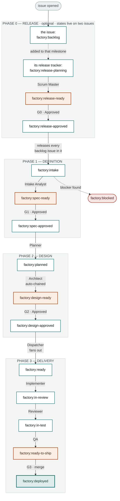

# Factory Pipeline States

Every issue in the factory carries exactly one `factory:*` label. That label is
the whole state — it decides which of the ten roles runs next, and nothing
advances without it moving.

The pipeline is not fifteen equal steps. It is **four phases**, each ending at a
point where a person decides whether the machine keeps going. Between those
points the factory runs unattended.

Phase 0 is optional: [[Release Gating]] describes it, and a repo without
`.github/factory-release.json` skips straight to phase 1 the moment an issue is
filed.

## The pipeline

Rust-filled states wait on a human. Everything else advances on its own the
moment the previous role finishes.

## The gates

| Gate | State it holds at | The question | How it opens |
|---|---|---|---|
| **G0** | `factory:release-ready` | Is this the right batch of work to start? | Owner comments `Approved` on the release tracker — or, in `"approval": "agent"` mode, the Scrum Master's own GO |
| **G1** | `factory:spec-ready` | Is the spec concrete enough to plan against? | Owner comments `Approved` |
| **G2** | `factory:design-ready` | Does the architecture actually solve it? | Owner comments `Approved` |
| **G3** | `factory:ready-to-ship` | May this land on `main`? | A human presses Merge |

G0 only exists with release gating on, and is the one gate that can be handed to
an agent — the set of issues in a milestone is input a model can read
completely, unlike a diff's consequences. G3 is not a comment. The factory has no permission to write to `main` at all —
it is enforced by the protected-branch hook, the `permissions.deny` block in
`.claude/settings.json`, and `factory-branch-guard.yml`, which opens a
`factory:incident` issue if a commit ever lands on `main` without a PR.

Who may approve at G0, G1 and G2 is set per-gate in `.github/factory-approvers.json`.
Ship it with real usernames — the template's placeholder means "any collaborator
may approve," which is probably not what you want.

## State ledger

| State | Role that leaves it | Trigger that moves it |
|---|---|---|
| `factory:backlog` | — waits — | Gate G0 on the milestone's release tracker · gating only |
| `factory:release-planning` | — waits — | Owner comments **Plan release** on the tracker (nothing runs before that) |
| `factory:release-ready` | — waits — | Owner comments **Approved** · gate G0 |
| `factory:release-approved` | — terminal for the tracker — | Its backlog issues move to `factory:intake` in the same run |
| `factory:intake` | Intake Analyst | Applied automatically on `issues.opened`, or by gate G0 |
| `factory:spec-ready` | — waits — | Owner comments **Approved** · gate G1 |
| `factory:spec-approved` | Planner | Runs in the same workflow as the approval |
| `factory:planned` | Architect | Chained in-run — a factory-applied label emits no event |
| `factory:design-ready` | — waits — | Owner comments **Approved** · gate G2 |
| `factory:design-approved` | Dispatcher | Fans the epic out into task sub-issues |
| `factory:ready` | Implementer | Comment **Approved** on the task claims it |
| `factory:in-review` | Reviewer | Code review against the approved design |
| `factory:in-test` | QA | Test suite and acceptance criteria |
| `factory:ready-to-ship` | — waits — | Human merges the PR · gate G3 |
| `factory:deployed` | Release / Ops | Terminal for the epic |
| `factory:blocked` | — halted — | Any role may apply it; resume is manual |

The labels are mutually exclusive and are created by
`scripts/setup-labels.sh <owner> <repo>`. Re-running it patches existing labels
rather than duplicating them. One label is not a state: `factory:release` marks
an issue as a release tracker, and sits alongside its `factory:release-*` state.

## Two things worth saying out loud

**Auto-chaining.** GitHub suppresses events for labels a workflow applied
itself — an anti-recursion measure. So `factory:planned` can never wake the
Architect, no matter how the trigger is written. The Architect is therefore
invoked *inside the Planner's own run*: one workflow, two roles. The same
constraint is why an implementer starts from a comment rather than from the
Dispatcher's label, and why a closing task has to re-run the Dispatcher
explicitly. See [[Control Architecture]].

**Re-dispatch.** The Dispatcher runs once, at `factory:design-approved`, which
strands any task that was blocked on a sibling. When a task sub-issue closes,
the factory re-runs the Dispatcher against its parent epic and releases whatever
was waiting. See [[Re-dispatch on Task Close]].

## See also

- [[Release Gating]] — phase 0 in full: milestones, the tracker, gate G0
- [[Run Trace Issue 16]] — these states, walked end to end on a real epic
- [[Control Architecture]] — how an event picks a role
