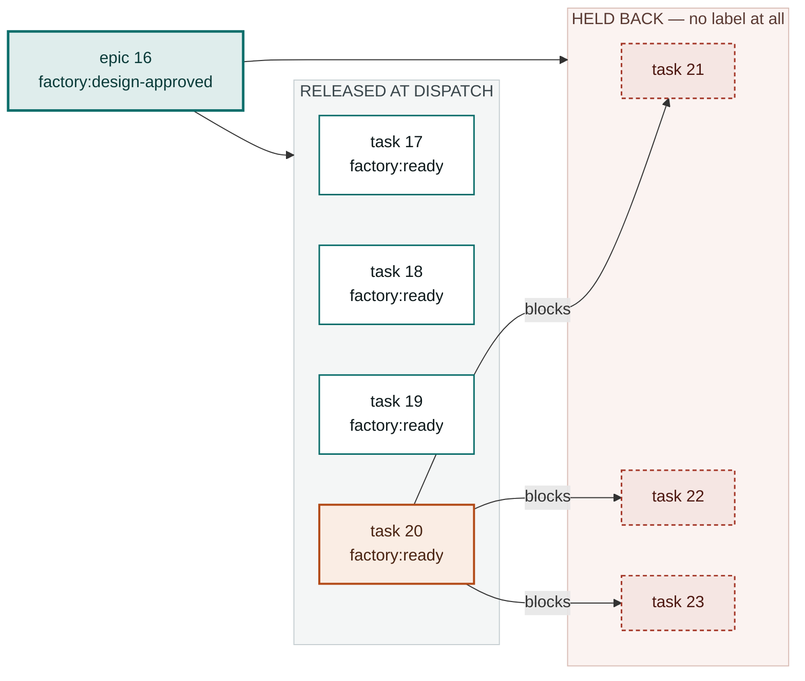
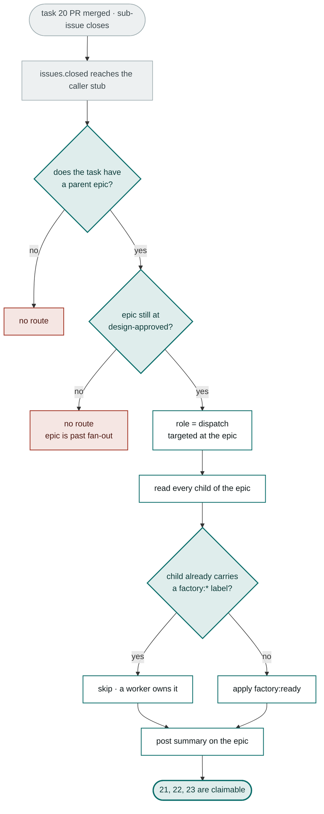

# Re-dispatch on Task Close

The Dispatcher runs once, at design approval. Anything that depended on a
sibling task was left unlabelled — invisible to the factory and to the people
working it. This page is the fix, and it cost **one word in a trigger list**.

## The dependency shape



An unlabelled sub-issue is not "waiting" as far as the factory is concerned — it
does not exist in *any* state, so no trigger can ever pick it up.

## Before and after

| | Before | After |
|---|---|---|
| | Task 20 merges and the epic stalls | Task 20 merges and the next wave starts |
| | Tasks 21–23 still carry no `factory:*` label | `issues.closed` reaches the pipeline |
| | Nothing is watching for task completions | Router finds the parent epic and checks its state |
| | The epic sits at `factory:design-approved` looking finished | Dispatcher re-runs against epic 16 |
| | Only a manual `workflow_dispatch` of the Dispatcher unsticks it | Tasks 21–23 get `factory:ready` within the minute |

## The re-dispatch path



## The two guards

**The epic must still be at `factory:design-approved`.** If it has already
advanced — every task labelled, work underway, or the epic itself past fan-out —
a late task closing must not drag the Dispatcher back through a stage it has
finished. Any other epic state means no route.

**A child that already carries a label is never relabelled.** If task 22 is
sitting at `factory:in-review` because someone claimed it, re-dispatch skips it
entirely. Only children with no `factory:*` label at all are candidates. This is
what makes the step safe to run repeatedly: it is idempotent, and it never takes
work out from under whoever owns it.

## The change

The router already knew how to handle a closing task. What it never received was
the event — the caller stubs only subscribed to `opened` and `labeled`.

```diff
  on:
    issues:
-     types: [opened, labeled]
+     types: [opened, labeled, closed]
    issue_comment:
      types: [created]
```

**Where it landed.** The same line changed in
`templates/workflows/factory-pipeline.yml` in the factory repo, so every future
install gets it, and in the consuming repo's own stub, so that repo gets it now.

**Why the stub and not the reusable workflow.** A called workflow cannot declare
its own triggers. Events are the one thing a consuming repo genuinely owns —
which is also why the stub is the only file that ever needs touching to upgrade.

**Scope.** Dispatcher logic is unchanged. It is the same code path that ran at
design approval, invoked a second time with the epic as its target.

## Upgrading an existing install

If a repo was set up before this change, its stub still has the two-event list.
Fix it in place:

1. Edit `.github/workflows/factory-pipeline.yml` in the consuming repo.
2. Add `closed` to `issues.types`.
3. Merge to the **default branch** — GitHub only fires workflow files that
   physically exist there.

Until that lands, epics still work; their blocked tasks just need a manual
`workflow_dispatch` of the `dispatch` role against the epic to be released.

## See also

- [[Run Trace Issue 16]] — step 05 is this mechanism firing for real
- [[Control Architecture]] — the router branch that routes `issues.closed`
