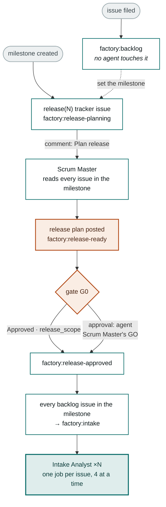

# Release Gating

Out of the box, filing an issue starts an agent. That is a good default for a
repo that gets a few requirements a month and a bad one for a team that plans in
releases: work enters one issue at a time, in the order it happened to be typed,
and nothing ever looks at the *set*.

Release gating adds a phase in front of intake. **A release is a GitHub
milestone.** A filed issue waits in `factory:backlog`; approving the milestone
starts every issue in it at once.

It is off unless `.github/factory-release.json` says otherwise, and turning it
off again is deleting that file.

## The shape of it



## The tracker issue

A milestone has no labels, no comments and nothing to approve on. So the
pipeline opens one issue per milestone to carry all three:

```
title:  release(7): v0.4 — renewals
labels: factory:release            ← kind marker, not a state
        factory:release-planning   ← the state
```

It is created when the milestone is created, or the first time an issue is added
to a milestone that hasn't got one — so milestones that predate the install pick
one up as soon as they are used. The tracker is itself filed against the
milestone, which is why every consumer of the milestone's issue list skips
anything carrying `factory:release`.

`factory:release` is the only label in the whole factory that is not a state.
Everything else is mutually exclusive; this one sits *alongside* a
`factory:release-*` state and identifies what kind of issue it is.

## Configuration

`.github/factory-release.json`, in the consuming repo:

```json
{
  "gating": "milestone",
  "approval": "human",
  "auto_create_release_issue": true,
  "exempt_labels": ["factory:fast-track"]
}
```

| Key | Effect |
|---|---|
| `gating` | `"milestone"` parks new issues; `"none"` (or no file) is the original behaviour |
| `approval` | `"human"` — a `release_scope` approver opens G0. `"agent"` — the Scrum Master's own GO verdict does |
| `auto_create_release_issue` | `false` if you'd rather open trackers by hand |
| `exempt_labels` | An issue filed with any of these skips the queue — the escape hatch for urgent fixes |

`release_scope` in `.github/factory-approvers.json` names who may run
`Plan release` and open G0. An empty list means any owner, member or
collaborator.

## What the Scrum Master is for

It is the only role that reads a *set* of requirements. Intake, planner and
architect each see exactly one issue, so anything that is only visible across
issues has to be caught here or not at all:

- **Duplicates and overlap** — two issues asking for the same thing, or one that
  an in-flight `openspec/changes/` folder already covers.
- **Sequencing between epics** — the schema change that has to land before the
  service that reads it. Task order *within* an epic is the planner's job;
  order *between* epics has no other owner.
- **Size** — an issue that is three releases' worth of work should be split
  before intake writes a spec for it.
- **Emptiness** — an issue with a title and no body will burn an intake run and
  come back asking questions. Cheaper to say so now.

Its output is one comment on the tracker: scope table, order, risks, what it
recommends dropping, and a one-line GO/NO-GO. It never touches the member
issues — releasing them is the pipeline's job, and doing it early double-starts
intake.

## Why the fan-out is a job matrix

Approving a release has to start N intakes. Two mechanisms were available and
only one is honest:

- **Label and let the events fire.** Labels applied by a workflow using the
  default `GITHUB_TOKEN` emit no trigger events (GitHub's anti-recursion rule),
  so this works only in repos that have configured a PAT. Silent no-op in the
  rest.
- **Run them in the same workflow run.** The `route` job emits a JSON array of
  issue numbers and the agent job declares
  `strategy.matrix.issue: ${{ fromJSON(...) }}` — normally one element, N after
  a release. `fail-fast: false`, four at a time.

The second is what ships. It is also why `release-chain` writes a
`<!-- factory-release-dispatched -->` marker into its receipt comment: with a
PAT configured, both the label event *and* the in-run chain can reach the same
release, and the second one must not start every intake twice.

`scripts/test-router.js` exercises all of this — it pulls the route and
release-chain scripts out of the workflow file and runs them against a fake
GitHub API, including the double-dispatch case.

## What it deliberately does not do

- **Stop work already in flight.** Pulling an issue out of a milestone parks it
  only if it hasn't passed intake. After that the milestone is bookkeeping.
- **Gate sub-issues.** `task(...)` issues are created by the planner downstream
  of G1 and are never parked.
- **Cross repos.** Milestones are per-repo, so a multi-repo epic is gated where
  its epic issue lives; the sibling-repo sub-issues the planner opens are
  unaffected.
- **Mean anything by a due date.** The milestone's due date and closed state are
  invisible to the factory. Only the tracker's label decides.

## See also

- [[Factory Pipeline States]] — phase 0 in the context of the other three
- [[Control Architecture]] — how the router turns a milestone event into a role
- [`FACTORY.md` §2d](https://github.com/genai-jerry/claude-software-factory/blob/v1/FACTORY.md) — the authority
