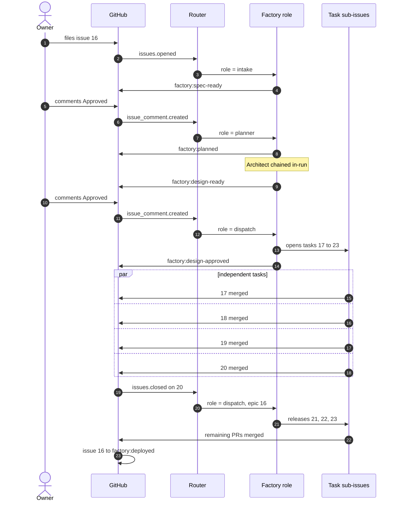

# Run Trace: Issue 16

The demonstration run. Issue 16 on `genai-jerry/insurance-app-base` went from a
filed request to a deployed feature across nine events — **three of them were a
person typing a single word**, and the rest was the factory moving on its own.

## Event sequence

Steps 5 to 10 are a **single workflow run**: the Planner finishes and hands
straight to the Architect without a second GitHub event.

## Step by step

Each block below is one workflow run.

### 01 · Issue 16 is filed

| | |
|---|---|
| **Event** | `issues.opened` |
| **Route** | `role = intake` |
| **Result** | Intake Analyst reads the request, sizes it, applies `factory:spec-ready` and posts its reading of the scope. |

### 02 · Owner approves the spec — Planner and Architect both run

| | |
|---|---|
| **Event** | `issue_comment.created`, body is **Approved** |
| **Route** | state is `factory:spec-ready` → `role = planner` |
| **Result** | Planner posts the delivery plan and applies `factory:planned`. The Architect is then invoked *inside the same run* — it posts the design and applies `factory:design-ready`. |
| **Why** | A label the factory applies itself fires no event, so waiting for one would stall here forever. |

This is the chained pair. On the Actions tab it is one run, not two.

### 03 · Owner approves the design — work is fanned out

| | |
|---|---|
| **Event** | `issue_comment.created`, body is **Approved** |
| **Route** | state is `factory:design-ready` → `role = dispatch` |
| **Result** | Dispatcher opens sub-issues **17–23**, labels the four independent ones `factory:ready`, and marks the epic `factory:design-approved`. |

Tasks 21–23 are deliberately left **unlabelled** — they depend on task 20.

### 04 · Four tasks run in parallel

| | |
|---|---|
| **Trigger** | A collaborator comments **Approved** on a `factory:ready` task to claim it |
| **Result** | Implementer opens a PR per task; Reviewer and QA move each through `factory:in-review` and `factory:in-test`; a human merges. Tasks 17, 18, 19 and 20 close. |

Task PRs target `staging` where the repo has one, otherwise the default branch —
set by `branches.staging` in `.factory/profile.json`.

### 05 · Task 20 closes and releases the tasks behind it

| | |
|---|---|
| **Event** | `issues.closed` on sub-issue 20 |
| **Guard** | Parent epic must still be at `factory:design-approved` |
| **Route** | `role = dispatch`, targeted at epic **16** |
| **Result** | Dispatcher re-scans the epic's children, skips any that already carry a state label, and applies `factory:ready` to **21, 22 and 23**. |

No one had to re-run anything by hand. This step is the subject of
[[Re-dispatch on Task Close]] — before that change, the epic stalled here
looking finished.

### 06 · The epic closes out

Last task PR merges, every sub-issue is closed, epic 16 lands on
`factory:deployed`.

## What this run exercised

- **Both comment gates** (G1 and G2) and the merge gate (G3)
- **In-run chaining** — Planner handing to Architect with no intervening event
- **Fan-out** — one epic to seven sub-issues with a dependency between them
- **Re-dispatch** — a closing task releasing its dependents automatically
- **The no-op guard** — an earlier attempt at this same issue finished green
  having changed nothing, because the role had been denied every tool. That
  failure is what the guard in [[Control Architecture]] now catches.

## See also

- [[Factory Pipeline States]] — the states this run moved through
- [[Re-dispatch on Task Close]] — step 05 in detail
